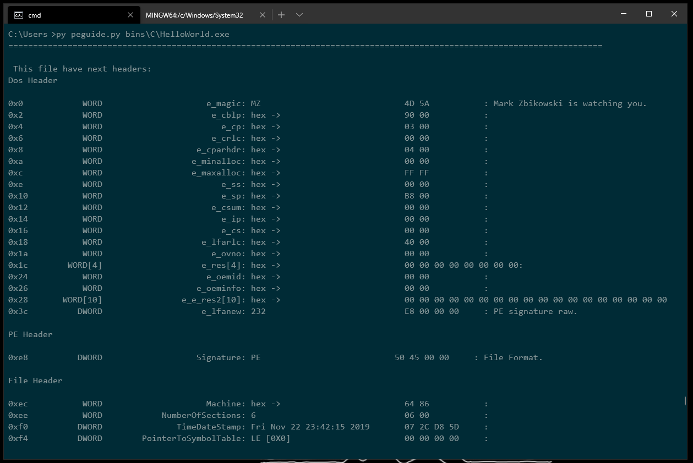

# PEguide

Show the structure of portable executable (PE) files under the Windows family of operating systems.

## About

Before watch what inside PE file we should install requirements:

    python -m pip install -r requirements.txt

And now we can look for treasure in our _helloworld.exe_:

    py peguide.py bins\C\HelloWorld.exe

### Options

- _--headers_ - show only headers with its descrition
- _--sections_ - show only row data of sections (binary, hex and printable symbols)
- _--tables_  show only tables if they exist (import, export)
- _--help_ show help message

### Extentions

Working with extentions:

- __.EXE__: PE32, PE32+
- __.DLL__ _unstable_
- __.ACM__ _unstable_
- __.SYS__
- __.DVR__ _unstable_
- other ones doesn't tested or doesn't have supporting at all.
